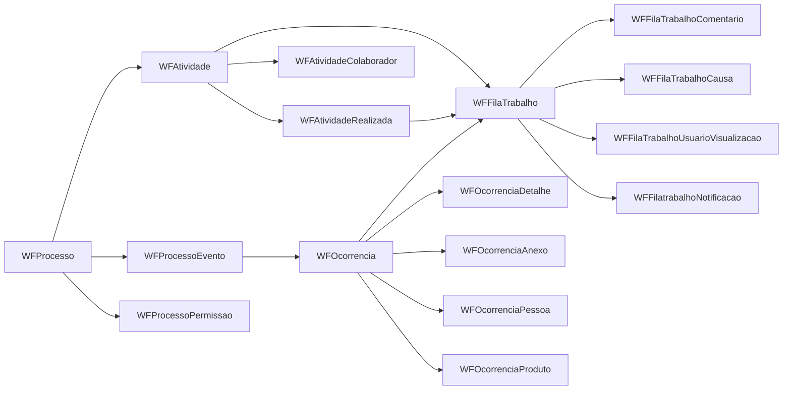

# Recurso WF/Fila de Trabalho - Interpretacao funcional

## Escopo
Este documento interpreta o funcionamento do recurso de Workflow e Fila de Trabalho com base no schema filtrado em `database/schema-observador-wf-fila.sql`.

O objetivo principal do modulo e controlar o ciclo de vida de ocorrencias operacionais, desde a configuracao do processo ate a execucao por responsaveis, com trilha de historico, comentarios, anexos e notificacoes.

## Visao geral do modelo
- **Configuracao do workflow**: `WFProcesso`, `WFProcessoEvento`, `WFAtividade`, `WFAtividadeRealizada`.
- **Execucao em fila**: `WFFilaTrabalho` como entidade central de atribuicao e progresso.
- **Ocorrencia e contexto**: `WFOcorrencia` e tabelas filhas de detalhe (`WFOcorrenciaDetalhe`, `WFOcorrenciaAnexo`, `WFOcorrenciaPessoa`, `WFOcorrenciaProduto`).
- **Apoio de decisao**: `WFPrioridade`, `WFImpacto`, `WFCausa`.
- **Governanca operacional**: permissoes (`WFProcessoPermissao`), colaboradores (`WFAtividadeColaborador`) e visualizacao/notificacao da fila.

## Fluxo logico interpretado

## Ciclo de vida funcional
1. **Definicao**: processos e atividades sao cadastrados, incluindo regras de expiracao e quem pode atuar.
2. **Disparo do evento**: um `WFProcessoEvento` gera uma `WFOcorrencia` (manual ou automatica).
3. **Entrada em fila**: a ocorrencia e associada a uma ou mais entradas em `WFFilaTrabalho`.
4. **Tratativa**: responsavel executa acao, registra comentario/anexo e define transicao via `WFAtividadeRealizada`.
5. **Encaminhamento ou finalizacao**: a fila pode gerar proxima etapa, expirar ou encerrar ocorrencia.
6. **Rastreabilidade**: visualizacoes, notificacoes e historicos preservam auditoria operacional.

## Entidades centrais e responsabilidade
### 1) Motor de processo
- `WFProcesso`: cadastro macro do fluxo e flags de uso de fila/nao conformidade.
- `WFProcessoEvento`: ponto de entrada do processo.
- `WFAtividade`: etapa executavel dentro do processo.
- `WFAtividadeRealizada`: definicao de resultado da atividade (sequencia ou finalizacao).

### 2) Motor de fila
- `WFFilaTrabalho`: unidade operacional atribuivel (quem faz, quando entrou, se expirou, se tomou ciencia).
- `WFFilaTrabalhoComentario`: comunicacao e anexos de tratativa.
- `WFFilaTrabalhoCausa`: associacao de causas na fila.
- `WFFilaTrabalhoUsuarioVisualizacao`: evidencia de consulta por usuario.
- `WFFilatrabalhoNotificacao`: rastreio de notificacoes emitidas.

### 3) Ocorrencia
- `WFOcorrencia`: cabecalho do caso/nao conformidade.
- `WFOcorrenciaDetalhe`, `WFOcorrenciaAnexo`, `WFOcorrenciaPessoa`, `WFOcorrenciaProduto`: contexto completo do evento.

## Regras inferidas do schema
- **Priorizacao**: `WFPrioridade` classifica urgencia da ocorrencia.
- **Classificacao de impacto e causa**: `WFImpacto` e `WFCausa` suportam analise de efeito-raiz.
- **Controle de responsabilidade**: `WFAtividadeColaborador` define executores/monitores por atividade.
- **Controle temporal**: campos de expiracao em atividade/evento/fila sugerem SLA operacional.
- **Controle de status**: flags como `expirada`, `ciente`, `confirmada` e `inativa` apontam para estados formais da tratativa.

## Relacoes de suporte incluidas no recorte
O fechamento transitivo por dependencia trouxe tabelas base como `Empresa`, `Usuario`, `Pessoa`, `AreaEmpresa`, `Produto`, `Colaborador` e estruturas de hierarquia mercadologica. Essas tabelas funcionam como referencia para integridade relacional das entidades WF/Fila.

## Interpretacao final
O recurso se comporta como um **orquestrador de atendimento operacional** orientado por eventos:
- o processo define regras;
- o evento abre uma ocorrencia;
- a ocorrencia materializa trabalho em fila;
- a fila distribui execucao e historico;
- a transicao de atividade decide continuidade ou encerramento.

Em termos praticos, e um modelo adequado para casos de nao conformidade, atendimento interno, tratativas multi-etapa e governanca de prazos com auditoria.
